<p align="center">
  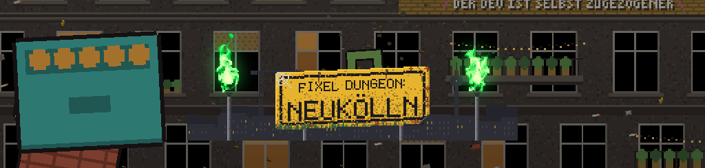
</p>

<h1 align="center">Pixel Dungeon Neukölln</h1>

<p align="center">
  <b>Du wolltest zur Sitzung beim Mieterverein und nur kurz das Fahrrad aus dem Keller holen.</b><br>
  Dann fiel die Brandschutztür zu, und jetzt verhandelst du 25 Ebenen tiefer selbst:<br>
  mit dem Endgegner, dem Ewigen Mietspiegel.
</p>

<p align="center">
  <code>Status: in Sanierung</code>
  <code>Lizenz: GPLv3</code>
  <code>Kaltmiete: Stand 1987</code>
  <code>Fertigstellung: vsl. Herbst</code>
</p>

Ein Roguelike auf Deutsch für Windows, macOS, Linux und Android. Kostenlos, ohne Werbung, ohne
Käufe im Spiel. Taktische Rundenkämpfe, niedliche Pixelgrafik und Gegner, die du aus dem Hausflur
kennst: Hausverwaltungen, Leihscooter und Makler. Es basiert auf dem Open-Source-Roguelike
[Shattered Pixel Dungeon](https://shatteredpixel.com/shatteredpd/) und ist ein inoffizieller
Fan-Fork, nicht vom Original-Entwickler unterstützt. Wer sich beschweren will: Das Amt liegt eine
Etage tiefer.

---

## Worum geht's


Irgendwo unter Neukölln liegt er: der **letzte unbefristete Mietvertrag Berlins**.
*Altbau, Kaltmiete von 1987, keine Staffel, kein Index, kein Eigenbedarf.*
Alle wollen ihn: die Hausverwaltung, der Investor, ein Schimmelpilz mit Sprechrolle
und der Ewige Mietspiegel, der alle zwei Jahre wächst.

Die Geschichte funktioniert wie eine Mängelanzeige: Jede Lösung erzeugt das nächste, größere
Problem. Du beschwerst dich über den Schimmel, landest beim Amt. Das Amt leitet dich nach unten
weiter, in die U-Bahn-Baustelle. Die Baustelle baut keine U-Bahn, sondern die Zufahrt zum
Luxusquartier. Und das Luxusquartier gehört jemandem, der selbst nur Mieter ist.

<table>
  <tr>
    <td width="330">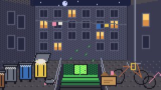</td>
    <td><b>Ebene 1-5: Neuköllner Hinterhöfe</b><br>
      Höfe, Keller, Kanäle. Pfandratten haben die Hausverwaltung übernommen, und niemand merkt einen Unterschied.<br>
      <b>Boss: Mietschimmel.</b> Er sagt, du hättest falsch gelüftet. Er sagt es in Großbuchstaben.<br>
      <i>„ICH BIN KEIN MANGEL. ICH BIN AUSSTATTUNG!“</i></td>
  </tr>
  <tr>
    <td>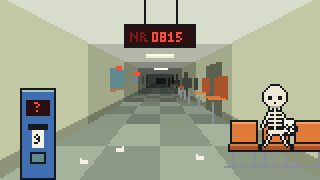</td>
    <td><b>Ebene 6-10: Das Amt ohne Termin</b><br>
      Eine Bürgeramt-Außenstelle in einem alten Gefängnis. Die Anzeige zeigt seit Jahren 0815. Wer lange genug wartet, wird zum ewig Wartenden.<br>
      <b>Boss: Der Kurzparker.</b> Ein SUV, der am Hinterausgang des Amts auf dem Tempelhofer Feld steht, „nur kurz“. Parkt um, wenn es eng wird, und verteilt Parkknöllchen.<br>
      <i>„Ich steh nur kurz hier.“</i></td>
  </tr>
  <tr>
    <td>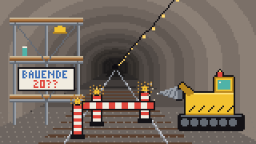</td>
    <td><b>Ebene 11-15: Die ewige Baustelle</b><br>
      Ein U-Bahn-Schacht, der seit Jahrzehnten „voraussichtlich im Herbst“ fertig wird. Im Tunnel läuft seit Freitag die Afterhour.<br>
      <b>Boss: DM-300 Bohrlinde.</b> Tunnelbohrmaschine mit Sekt-Taufe.<br>
      <i>„KRITISCHER SCHADEN! NEUER ERÖFFNUNGSTERMIN: UNBEKA-“</i></td>
  </tr>
  <tr>
    <td>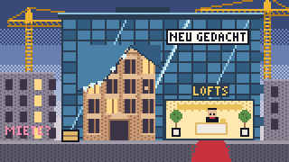</td>
    <td><b>Ebene 16-20: Das Renditequartier</b><br>
      Kneipen sind Showrooms, der Club ist ein Bioladen, und der letzte Späti klemmt zwischen Concept Store und Musterwohnung.<br>
      <b>Boss: König der Eigentumswohnungen.</b> Hortet den Mietvertrag, nicht um darin zu wohnen, sondern um ihn zu besitzen.<br>
      <i>„Das ist Privatgelände! Ab morgen auch dein Flur.“</i></td>
  </tr>
  <tr>
    <td>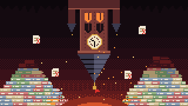</td>
    <td><b>Ebene 21-25: Unter dem Rathaus</b><br>
      Das Grundübel unter allem. Akten werden zu Fels, ganz unten hängen alte Ortsschilder: Rixdorf.<br>
      <b>Endboss: Ewiger Mietspiegel.</b> Kein Mensch, sondern eine Tabelle. Spricht. In. Punkten.<br>
      <i>„DEINE. HOFFNUNG. IST. NICHT. ORTSÜBLICH!“</i></td>
  </tr>
</table>

Die Bosse kämpfen mit den bewährten Mechaniken des Originals. Neu sind Namen, Texte und
(teilweise) Grafik, siehe [Baufortschritt](#baufortschritt).

---

## Die Hausgemeinschaft

Vier Rollen, alle von Anfang an spielbar. Jede Gruppe im Kiez hat eine Stärke und einen
blinden Fleck, und alle kriegen gleich viel ab.

<table>
  <tr>
    <td width="50%" valign="top">
      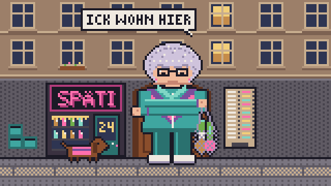<br>
      <b>Die Alteingesessene</b> <sub>(Kriegerin, Tank)</sub><br>
      Hat drei Sanierungen, vier Quartierskonzepte und eine Mietpreisbremse überlebt. Ihr Kiez-Aufnäher gibt Abschirmung, und Rückstoß wirft sie nur halb so weit zurück wie andere. Umziehen? <i>Ick wohn hier.</i>
    </td>
    <td width="50%" valign="top">
      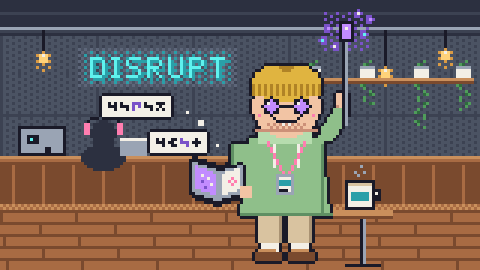<br>
      <b>Der Expat</b> <sub>(Magier)</sub><br>
      Zaubert mit einem magischen Selfie-Stick und Beschwörungen wie <i>„Let's circle back!“</i> oder <i>„Synergy!“</i>. Er nennt seine Magie disruptiv, und die kaputten Wände geben ihm recht. Niemand versteht den Pitch. Die Geschosse schon.
    </td>
  </tr>
  <tr>
    <td valign="top">
      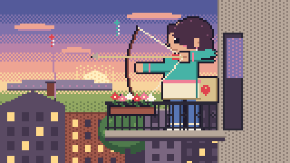<br>
      <b>Die Zugezogene</b> <sub>(Fernkampf)</sub><br>
      Hält Probleme mit einem Upcycling-Bogen und unendlich vielen Pfeilen auf Abstand und zertrampelt kein Gras. Gekommen ist sie wegen der guten Anbindung. Geblieben ist der Abstand. Plan: erst mal ankommen. Seit sechs Jahren.
    </td>
    <td valign="top">
      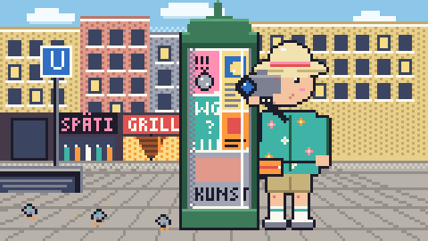<br>
      <b>Der Tourist</b> <sub>(Schurke, Schleicher)</sub><br>
      Wird im Poncho der Schatten unsichtbar und schlägt aus dem Nichts zu. Er sucht das authentische Neukölln. Leider sucht es inzwischen zurück. Er ist nur übers Wochenende hier, seit zwölf Wochenenden.
    </td>
  </tr>
</table>

---

## Die Nachbarschaft

Die meisten Gegner des Originals tragen jetzt Kiez-Namen (die Ratte ist eine Pfandratte, die
Schlange ein Verlängerungskabel). Dazu kommen **neue Gegner mit eigener Mechanik**. Regel für
alle: Das Setting ist absurd, die Regeln sind fair. Wer eine Sonderattacke plant, kündigt sie an,
und die betroffenen Felder werden markiert.

| | Gegner | Ebene | Was er tut | Warum er so ist |
| :-: | --- | :-: | --- | --- |
|  | **Leihscooter** | 2-5 | Steht er 2 bis 5 Felder entfernt in gerader Linie zu dir, klingelt er einen Zug lang und rast dann bis zu 6 Felder geradeaus. Ist die Spur leer, kracht er in die Wand und liegt 2 Züge quer. | Einen Parkplatz hat er noch nie gefunden. Gesucht hat er auch nicht. |
|  | **Pfandgolem** | 3-5 | Halb so schnell wie du, schlägt aber kräftig zu. Beim Tod zerspringt er in ein Scherbenfeld, das 20 Züge liegen bleibt und bei jedem Schritt verletzt. | Hat so lange auf den Rückgabeautomaten gewartet, dass ihm Beine gewachsen sind. Keine Scherbe ist rückgabefähig. |
|  | **Makler** | 6-10 | Jeder Treffer schickt dich 3 Züge in die Warteschleife (verlangsamt). Danach zieht er sich 4 Züge zurück und kommt wieder. | Hat alle Termine des Amts in der ersten Sekunde per Skript gebucht und vermittelt sie weiter, wie Wohnungen. Provision: zwei Nettokaltmieten. |
|  | **Presslufter** | 11-15 | Steht er neben dir, läuft sein Hammer einen Zug warm, dann trifft er alle 8 Nachbarfelder gleichzeitig. Ein Schritt weg reicht. | Niemand weiß, wer ihn beauftragt hat. Niemand traut sich, ihn abzubestellen. |
|  | **Technojünger** | 11-15 | Schläft nie. Kündigt im Umkreis von 2 Feldern einen Bass-Drop an, der alle 2 Felder wegschleudert und 3 Züge schwindelig macht. | Kam Freitag rein, ist nie wieder rausgegangen. Die Sonnenbrille bleibt auf, die Sonne ist hier unten nur ein Gerücht. |
|  | **Luxussanierer** | 16-20 | Vermisst die freien Felder hinter dir und stellt dort im nächsten Zug Bauzäune auf, die für 8 Züge Weg und Sicht blockieren. | Sieht überall Potenzial, besonders dort, wo gerade noch jemand wohnt. Über deinem Fluchtweg plant er eine Dachterrasse. |
|  | **Hausordnungs-Hydra** | ab 21 | Verkündet für 3 Züge abwechselnd **Ruhezeit** (Bewegen kostet Lebenspunkte) oder **Kehrwoche** (Stehenbleiben kostet Lebenspunkte). Die erste Aktion nach der Ansage ist frei. | Jeder Kopf wurde von einer anderen Hausverwaltung verfasst, und keiner hat die anderen gelesen. |

Echte Bauzäune stehen länger als 8 Züge. Das ist die einzige bewusste Abweichung von der Realität.

---

## Infrastruktur

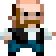

**Der Spätimann.** Auf den Ebenen 6, 11 und 16 steht die letzte funktionierende Infrastruktur
unter Neukölln: ein Späti. Der Spätimann kauft deine Fundstücke an, verkauft Vorräte und ist hier
unten der Einzige, der zuständig ist. Erst in der ehemaligen Amtskantine, dann im Bauwagen, dann
eingeklemmt zwischen Concept Store und Showroom.

> Firmenkreditkarte? Nee, Kollege. Pitch ooch nich. Münzen.
>
> Der März war hier. Hat vorm Laden 'n Foto gemacht, ernster Blick, Hand am Kühlschrank, "nah an den Menschen". Gekauft hat er nix. Die Einkaufstüte hatte er mitgebracht.

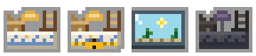

**Beute vom Bordstein.** Was du findest, liegt dort, wo es in Neukölln immer liegt: im Sperrmüll.
Manche Berge sind angekettet, manche sind Vitrinen, und manche beißen. Das sind dann
Sperrmüllmonster. Zu verschenken war hier noch nie etwas.


**Pass auf, wo du hintrittst.** Jede Falle ist ein Hundehaufen. Die Farbe verrät die Wirkung, das
Fähnchen die Form, und wer reintritt, weiß danach Bescheid. Sie heißen „lodernder Haufen“,
„tiefgefrorener Haufen“ oder „bodenloser roter Haufen“. Der harmloseste ist der „verwitterte
Blasrohr-Haufen“. Er ist so alt, dass er nicht einmal versteckt ist. Bestandsschutz.

**Stadttauben zum Werfen.** Blinzeltaube, Böllertaube, Mittagsschlaf-Taube und zehn weitere: Jede landet, macht ihr Ding und fliegt davon. Die Alteingesessene wirft keine Steine, sie schickt Hoftauben los.

**Sternchen-Pils.** Heilt, wenn du vorher genug Biertropfen gesammelt hast. Dazu Baklava vom Konditor an der Sonnenallee als Proviant, gleich neben Barbershop und Shisha-Bar.

**Wohnungsgesuche an der Wand.** Abreißzettel mit Nummer 0176-KEINE-HOFFNUNG. „Hund heißt Keks, ist aber auch bereit auszuziehen.“

**Samenbomben.** Guerilla-Gärtnern mit Folgen: Mietsenkungsblume, Kehrwochenkraut,
Räumungsklee, Neidmoos, Pflasterkraut. Die Mietsenkungsblume ist das Unrealistischste im ganzen Spiel.

**Techno aus dem Keller.** 31 Tracks Berliner Techno, eigens für das Spiel geschrieben und komplett
im Code synthetisiert, dazu eigene Klangbetten fürs Intro. Jede Region hat ihren eigenen Sound, vom
Hinterhof bis unter das Rathaus. Kein Türsteher, keine Gästeliste, du bist drin.

---

## Echte Bewertungen\*

> ★★★★★ *„Wir sehen in diesem Spiel großes Entwicklungspotenzial. Die Kellerräume werden ab sofort als Atelier vermietet.“*<br>
> **Hausverwaltung Rendita GmbH**, Abteilung Bestandsoptimierung

> ★☆☆☆☆ *„Die Bauzäune verschwinden nach 8 Zügen wieder. Völlig unrealistisch. Bei mir steht einer seit 2019.“*<br>
> **Anwohnerin**, Seitenflügel, 3. OG

> ★★★★★ *„Endlich ein Spiel, in dem man auf einen Termin warten kann, ohne das Haus zu verlassen.“*<br>
> **Wartenummer 0816**, laut Anzeige als Nächstes dran

> ★★☆☆☆ *„Der Mietschimmel sagt, ich hätte falsch gelüftet. Ich habe gar kein Fenster.“*<br>
> **Mieter**, Souterrain mit Galerie (lichtdurchflutet, Fackel mitbringen)

> ★★★★★ *„Super authentisch! Wurde gleich am ersten Tag von einem Leihscooter angefahren. Wie im echten Urlaub.“*<br>
> **Tourist**, nur übers Wochenende hier (seit 2014)

> ★★★★☆ *„Mein Expat sagt ‚Let's circle back!‘ und dann explodiert eine Wand. Genau wie im Büro. Ein Stern Abzug, weil keine Wand ein Follow-up-Meeting angesetzt hat.“*<br>
> **Teamlead**, Hinterhof-Coworking

> ★★★☆☆ *„Ruhezeit und Kehrwoche gleichzeitig? Kenne ich aus meinem Treppenhaus. Hätte lieber was Fiktionales gespielt.“*<br>
> **Hausgemeinschaft Vorderhaus**, 14 Unterschriften, keine davon leserlich

> ☆☆☆☆☆ *„Der Hinterhof in diesem Spiel ist nicht aufgeräumt. Mehr Ordnung, sofort! Bewertung folgt ab der nächsten Legislatur.“*<br>
> **Büro Kanzler März** (frei erfundene Figur), Fototermin bereits erledigt

> ★★★★★ *„Karte erst ab zehn Euro.“*<br>
> **Der Spätimann**, auf die Frage, ob ihm das Spiel gefällt

<sub>\* Alle Bewertungen sind frei erfunden. Alle Personen, Firmen und Kanzler ebenso. Ähnlichkeiten mit realen Nachbarn sind unvermeidlich, aber nicht beabsichtigt.</sub>

---

## Besichtigungstermin

Aufnahmen aus dem laufenden Spiel (Desktop, Ebene 1). Besichtigung nur mit Termin, Schuhe bitte ausziehen.

<table>
  <tr>
    <td width="50%">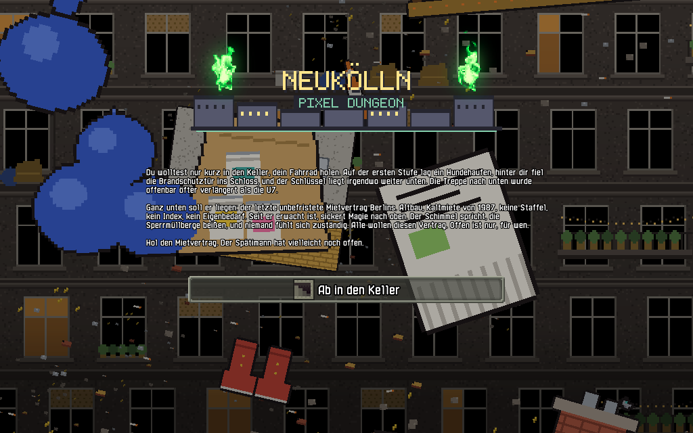<br><sub>Die Vorgeschichte: Fahrrad im Keller, Brandschutztür zu, Schlüssel weg.</sub></td>
    <td width="50%">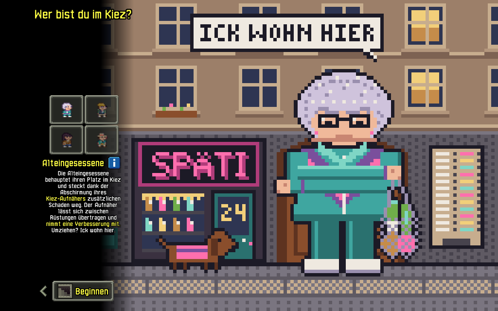<br><sub>„Wer bist du im Kiez?“ Die Alteingesessene vor ihrem Späti.</sub></td>
  </tr>
  <tr>
    <td>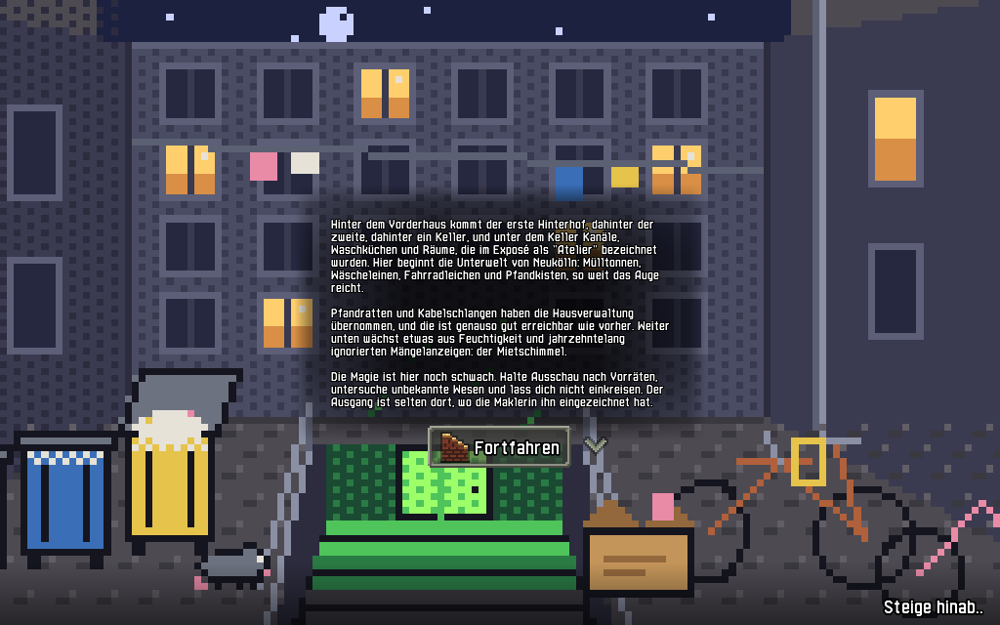<br><sub>Hinter dem Vorderhaus kommt der erste Hinterhof. Und dann die Räume, die im Exposé „Atelier“ hießen.</sub></td>
    <td>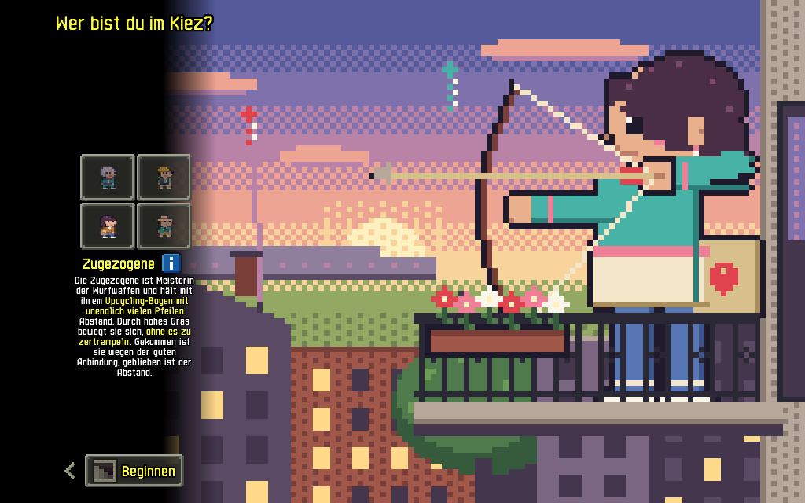<br><sub>Die Zugezogene auf dem Balkon, für den sie hergezogen ist.</sub></td>
  </tr>
  <tr>
    <td>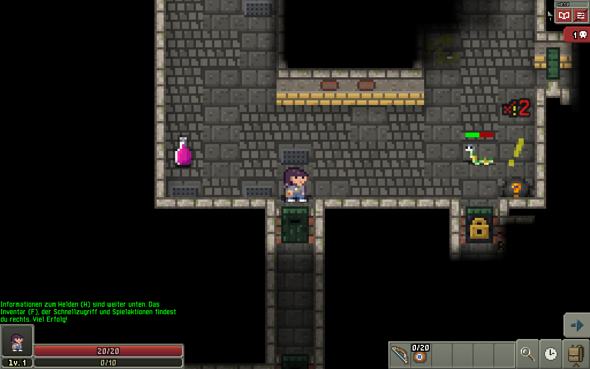<br><sub>Die Zugezogene gegen eine Kabelschlange. Die Schlange weicht aus.</sub></td>
    <td>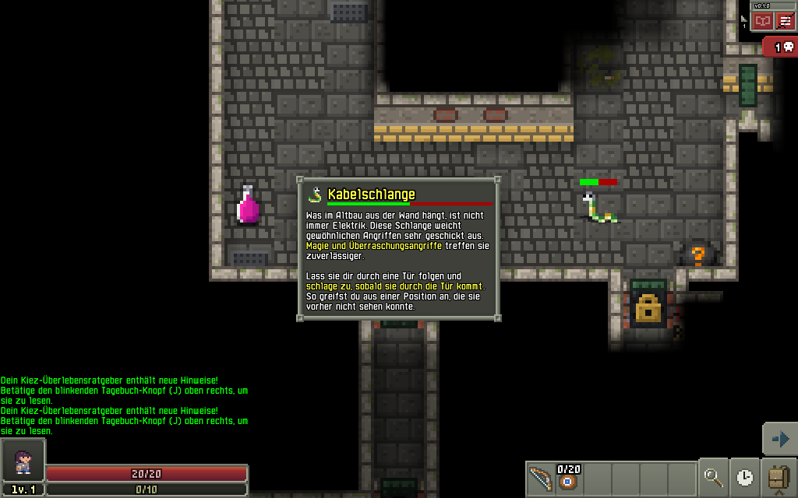<br><sub>„Was im Altbau aus der Wand hängt, ist nicht immer Elektrik.“</sub></td>
  </tr>
  <tr>
    <td>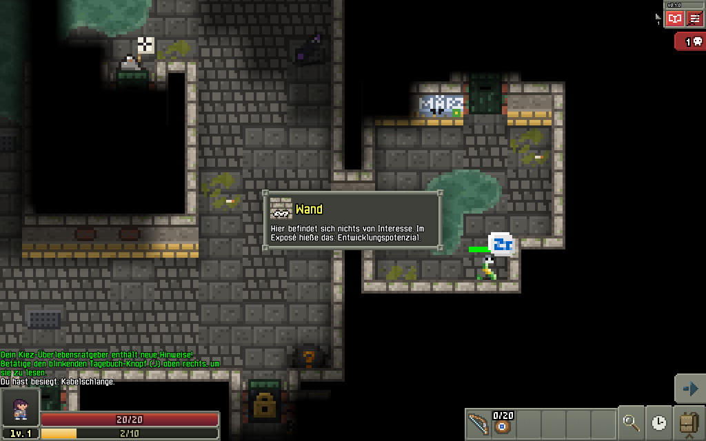<br><sub>Wahlplakat an der Kellerwand. Die Wand selbst hat laut Exposé Entwicklungspotenzial.</sub></td>
    <td>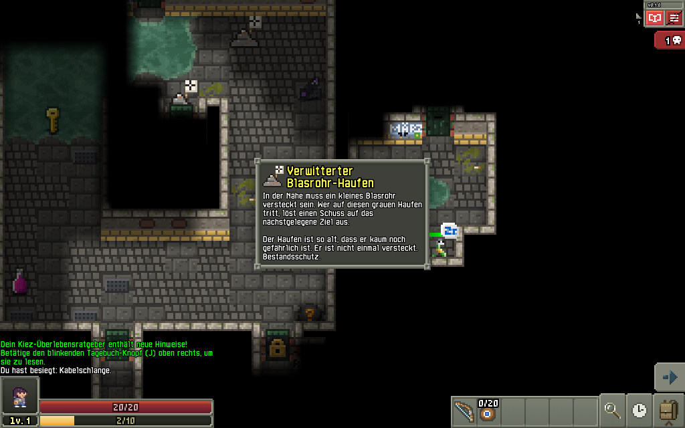<br><sub>Ein Hundehaufen mit Falle. Er ist so alt, dass er Bestandsschutz genießt.</sub></td>
  </tr>
</table>

---

## Einziehen

**Fertige Pakete** (Java ist jeweils eingebaut, nichts extra installieren):

| System | Paket | So geht's |
| --- | --- | --- |
| Android | `.apk` | Herunterladen, antippen, Installation aus dieser Quelle einmal erlauben |
| Windows | `.msi` oder `.zip` | Installer starten oder Ordner entpacken und `Pixel Dungeon Neukölln.exe` öffnen |
| macOS | `.dmg` oder `.zip` | App in „Programme“ ziehen, beim ersten Start Rechtsklick → Öffnen (die App ist nicht bei Apple beglaubigt) |
| Linux (Ubuntu, Debian, Mint) | `.deb` | `sudo apt install ./pixel-dungeon-neukoelln-<Version>-linux-x64.deb` |
| Linux (Fedora, openSUSE) | `.rpm` | `sudo dnf install ./pixel-dungeon-neukoelln-<Version>-linux-x64.rpm` |
| Linux (alle) | `.tar.gz` | Entpacken und `bin/Pixel-Dungeon-Neukoelln` starten |

**[Neueste Version herunterladen](https://github.com/codeausberlin/pixel-dungeon-neukoelln/releases/latest)**,
dort unter *Assets* das Paket für dein System wählen. Jedes Paket enthält eine `LIESMICH.txt`, die
Lizenzen und einen Link auf genau den Quellcode, aus dem es gebaut wurde. Prüfsummen stehen in
`SHA256SUMS.txt`.

**Aus dem Quellcode.** Du brauchst ein **JDK 17 oder neuer** (getestet mit 21, zum Beispiel
Temurin von [adoptium.net](https://adoptium.net/)). Prüfen mit `java -version`.

```
git clone https://github.com/codeausberlin/pixel-dungeon-neukoelln.git
cd pixel-dungeon-neukoelln
./start-neukoelln.sh --build
```

`--build` braucht es nur nach einem Update (`git pull`), sonst reicht `./start-neukoelln.sh`.
Auf dem Mac startet sich das Spiel beim ersten Öffnen einmal selbst neu. Das ist normal und keine
Eigenbedarfskündigung.

**Testmodus** (nur Entwicklerversion, Anzeige „INDEV“): direkt auf eine Ebene springen, um Regionen
und Gegner anzuschauen. Der Held startet dann ohne Ausrüstung, fair ist das nicht.

```
NK_START_DEPTH=11 ./gradlew desktop:debug
```

**Spielstände** liegen getrennt von Shattered Pixel Dungeon, auf dem Mac unter
`~/Library/Application Support/Neukoelln Pixel Dungeon/`. Deine Shattered-Läufe bleiben unangetastet.
Das ist mehr Kündigungsschutz, als die meisten hier haben.

Mehr Details: [docs/NEUKOELLN-START.md](docs/NEUKOELLN-START.md), zum Bauen der Pakete
[docs/NEUKOELLN-RELEASE.md](docs/NEUKOELLN-RELEASE.md). iOS ist ein späteres Ziel.

---

## Baufortschritt

Version 0.1.0. **In Entwicklung.** Fertigstellung voraussichtlich im Herbst. Welcher Herbst, steht
nicht da.

**Steht (eingebaut, Build und Smoke-Test laufen):**
- Deutsche Texte für Gegner, Bosse, Gegenstände, Ebenen, Tagebuch und Pflanzen auf Neukölln umgeschrieben
- Vier Rollen mit eigenen Heldensprites und Splash-Bildern
- Fünf Regionen mit eigenen Tilesets, 25 Ebenen, alle Bosse und der Ewige Mietspiegel als Endgegner
- Neue Gegner mit eigener Mechanik (Leihscooter, Pfandgolem, Makler, Presslufter, Technojünger, Luxussanierer, Hausordnungs-Hydra und mehr)
- Mietvertrag als Siegziel, Sperrmüllberge, Hundehaufen, Stadttauben, Samenbomben, Wanddeko mit Graffiti, Plakaten und Wohnungsgesuchen
- Der Spätimann auf 6, 11 und 16
- Vertontes Intro vor jedem neuen Spiel: auf dem Weg zum Mieterverein, M41 weg, ab in den Keller
- Club-Labyrinth auf Ebene 16-19: du wachst ohne Ausrüstung im Club auf und sammelst 7 Garderobenmarken
- Der Netztechniker (seit zwei Jahren erwartet) mit seiner Glasfaser-Quest, Abgründe als A100-Baulücken
- Eigener Techno-Soundtrack mit 31 Tracks
- Logo und App-Icon: ein schiefes, verwittertes Ortsschild vor der Berliner Skyline
- Pakete für Android (signierte APK), Windows (`.msi`), macOS (`.dmg`) und Linux (`.deb`, `.rpm`, `.tar.gz`), gebaut per GitHub Actions

**Im Spiel geprüft (QA-Durchgang am 30.9.2026, Desktop):** alle vier Rollen, Speichern und Laden,
jede Region, die Bosse, der Club, der Mietvertrag bis zum Siegfenster. Keine Abstürze. Für die
tiefen Ebenen liefen dabei Testhilfen mit (aufgedeckte Karte, viele Lebenspunkte), Details in
[docs/NEUKOELLN-QA.md](docs/NEUKOELLN-QA.md). Die signierte Android-APK lief danach eine Stunde auf
einem echten Handy, ohne Probleme.

**Noch Rohbau:**
- Ein kompletter Lauf ohne Testhilfen bis zum Mietvertrag steht aus, ebenso das Balancing
- Die Kämpfe gegen Bohrlinde, König der Eigentumswohnungen und Ewigen Mietspiegel wurden angespielt, aber nicht zu Ende gekämpft
- Windows- und macOS-Pakete sind auf echten Geräten noch nicht getestet; iOS kommt später
- Die Soundeffekte sind bewusst die des Originals
- Nur Deutsch ist umgebaut; Englisch und alle anderen Sprachen zeigen den Text von Shattered Pixel Dungeon
- Einige Texte sind noch Upstream oder Englisch, zum Beispiel das Änderungsprotokoll im Spiel

Den ausführlichen Stand führt [docs/NEUKOELLN-AUDIT.md](docs/NEUKOELLN-AUDIT.md). Welt, Ton und
Figuren stehen in [docs/NEUKOELLN-WELT.md](docs/NEUKOELLN-WELT.md) und
[docs/NEUKOELLN-WRITERSROOM.md](docs/NEUKOELLN-WRITERSROOM.md).

---

## Hausordnung

- Satire tritt nach oben: Vermieter, Makler, Hausverwaltungen, Behörden als Apparat, Politik als Stil.
- Gelacht wird über Verhalten, nie über Herkunft, Religion, Behinderung, Sucht oder Armut.
- Alle Personen, Firmen, Clubs und Politiker im Spiel sind frei erfunden. Kanzler März ist eine Parodie auf einen Politikstil, keine reale Person. Reale Straßen und Plätze sind nur Kulisse.
- Geschichten aus dem Netz sind Inspiration, keine Tatsachenbehauptungen über echte Menschen.
- Das Setting darf absurd sein, die Regeln nicht.

---

## Credits und Lizenz

**Pixel Dungeon Neukölln** ist ein inoffizieller deutscher Fork von Shattered Pixel Dungeon und wird
**nicht vom Original-Entwickler unterstützt**. Neukölln-Setting, neue Gegner, Texte und Pixelart:
[codeausberlin](https://github.com/codeausberlin). Fehler in diesem Fork bitte hier melden, nicht beim Original.

Ohne diese Leute gäbe es hier nicht mal einen Keller:

- **[Shattered Pixel Dungeon](https://shatteredpixel.com/shatteredpd/)**, entwickelt von **Evan Debenham** ([ShatteredPixel.com](https://shatteredpixel.com))
- basierend auf dem Quellcode von **[Pixel Dungeon](https://github.com/00-Evan/pixel-dungeon-gradle)** von **[Watabou](https://watabou.itch.io/)**
- Splash- und Dungeon-Art des Originals: Aleksandar Komitov; Musik: Lumine Haaristo; Item-Pixelart: PumpkinVolt; Soundeffekte: Celesti; weitere Pixelart: Alastair Braun; Pixel-Dungeon-Musik: Cube Code
- [libGDX](https://libgdx.com/), Pixel Dungeon GDX (Edu García), Shattered GDX Help (Kevin MacMartin) und alle ehrenamtlichen Übersetzerinnen und Übersetzer von Shattered

Die vollständigen Credits stehen im Spiel unter **Über**, der Neukölln-Block oben, die Credits des
Originals unverändert darunter.

**Lizenz:** GNU General Public License v3.0, siehe [LICENSE.txt](LICENSE.txt). Wie das Original ist
auch dieser Fork freie Software: Du darfst ihn nutzen, verändern und weitergeben, solange der
Quellcode unter derselben Lizenz offen bleibt.

### Das Original

Wenn dir das hier gefällt, spiel das Original. Es hat mehr Inhalt und keine Hundehaufen.
Shattered Pixel Dungeon ist ein Open-Source-Roguelike mit zufälligen Ebenen, Gegnern und Hunderten
Gegenständen und läuft auf Android, iOS und Desktop. Offizielle Versionen gibt es bei
[Google Play](https://play.google.com/store/apps/details?id=com.shatteredpixel.shatteredpixeldungeon),
im [App Store](https://apps.apple.com/app/shattered-pixel-dungeon/id1563121109),
auf [Steam](https://store.steampowered.com/app/1769170/Shattered_Pixel_Dungeon/),
[GOG.com](https://www.gog.com/game/shattered_pixel_dungeon),
[itch.io](https://shattered-pixel.itch.io/shattered-pixel-dungeon) und über die
[GitHub-Releases](https://github.com/00-Evan/shattered-pixel-dungeon/releases).
Der Blog des Entwicklers
liegt auf [ShatteredPixel.com](https://www.shatteredpixel.com/blog/), die Übersetzungen des Originals
laufen über [Transifex](https://explore.transifex.com/shattered-pixel/shattered-pixel-dungeon/).

Das Original-Repository nimmt keine Pull Requests an; Fehlerberichte zum Original gehören dorthin,
Fehlerberichte zu Neukölln hierher.

Anleitungen aus dem Original zum Bauen und Anpassen liegen in `/docs` (englisch):
- [Compiling for Android](docs/getting-started-android.md)
    - **[If you plan to distribute on Google Play please read the end of this guide.](docs/getting-started-android.md#distributing-your-app)**
- [Compiling for desktop platforms](docs/getting-started-desktop.md)
- [Compiling for iOS](docs/getting-started-ios.md)
- [Recommended changes for making your own version](docs/recommended-changes.md)
